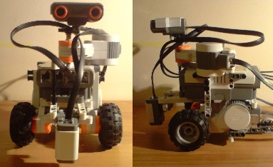
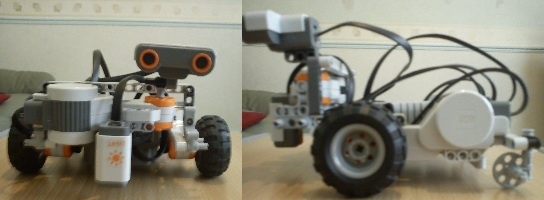

# Legacy LEGO Mindstorms NXT C Projects

Legacy projects for the [LEGO Mindstorms NXT platform](https://en.wikipedia.org/wiki/Lego_Mindstorms_NXT).

The chosen language for programming the NXT is called [NXC](https://bricxcc.sourceforge.net/nbc/nxcdoc/nxcapi/intro.html); a subset of the C language.

Some projects also contain counterpart programs written in [MATLAB](https://www.mathworks.com/products/matlab.html) and/or [Processing](https://processing.org). These are archived in the [JM-legacy-matlab-and-processing-projects repository](https://github.com/jo3-tech/JM-legacy-matlab-and-processing-projects).

These projects were created between 2008 and 2013, during my early journey into programming. My initial exposure to coding came through specific modules from my mechanical engineering undergraduate degree, and engineering design masters degree. These modules were focused primarily on learning programming languages for use in projects, rather than broader software development practices. After more than a decade working professionally as a mechanical engineer, I transitioned into software engineering in 2023. These legacy projects mark the beginning of that evolution — archived here as a record of where it all started.

These projects were early-stage prototypes and were never fully finalised. All code, documentation, and descriptions were originally written over a decade ago and have been copied here with only minor modification. As such, they may lack polish, clarity, or completeness, and do not reflect current best practices.

The recommended method to build these projects is using the [BricxCC IDE](https://bricxcc.sourceforge.net) version 3.3.

## line-following-and-obstacle-avoidance

The aim of [this project](line-following-and-obstacle-avoidance/line-following-and-obstacle-avoidance.nxc) was to use a Lego Mindstorms Kit to build an autonomous robot that will follow a drawn out path, avoid any obstacles in its path and find its way back onto the path. A PID control algorithm is implemented for smooth line tracking.

## object-tracking-using-colour

The aim of this project was to create a robot that could track (and follow) an object using it's colour.

A counterpart android application called [NXTcam](https://github.com/jo3-tech/JM-legacy-matlab-and-processing-projects/tree/main/nxtcam-android) was created to perform an image processing task to identify and locate the coloured object. It is archived in the [JM-legacy-matlab-and-processing-projects repository](https://github.com/jo3-tech/JM-legacy-matlab-and-processing-projects).

The application in this repository is meant to run on the NXT robot, and receive the objects location co-ordinates via Bluetooth, so as to control the drive system to follow the object.

## slam

The following examples form part of a larger project to implement SLAM (simultaneous localisation and mapping). The aim was to create a robot that could map an enclosure and ensure complete coverage of an area without unnecessary revisits.

### slam-graph-traversal-with-visited-state-tracking

[This part](slam-graph-traversal-with-visited-state-tracking/slam-graph-traversal-with-visited-state-tracking.nxc) of the SLAM project was aimed at creating an algorithm for the robot to search a room or enclosure without ever visiting the same place twice, by tracking visited cells to prioritise travel to unexplored area.

It uses [differential drive (2-wheel) odometry](documentation/slam-localisation-algorithm.pdf) for localisation, i.e., to determine the robots change in position with respect to its starting position. Any time the robot encounters an obstacle, it creates an imaginary square tile around itself by calculating the x & y positions of the edges of a square that surrounds the robot at its current position. Before moving off, it predicts its position along the path to check if any of the predicted x,y values fall within the edges of any previous square tiles created, if so, it continues to generate random points in the environment and perform the calculation until it finds one along a path that hasn't been visited before. When it finds a path that hasn't been visited, it moves off in that direction.

### slam-navigation-localisation-and-mapping

[This part](slam-navigation-localisation-and-mapping) of the SLAM project was aimed at creating an algorithm for the robot to navigate a room or enclosure and create a 2D map of it.

A basic [navigation algorithm](documentation/slam-navigation-algorithm.pdf) is developed to aid the robot in making decisions. It uses a [dead reckoning algorithm](documentation/slam-localisation-and-mapping-using-dead-reckoning.pdf) to keep track of its location as it navigates the enclosure.

The video shows the results of version 1. Version 2 was left in a work-in-progress state.

## utilities_for_nxt-arduino-i2c_communication

[This project](utilities-for-nxt-arduino-i2c-communication/utilities-for-nxt-arduino-i2c-communication.nxc) provides collection of I2C utility functions for reading and controlling various sensors and actuators via an Arduino microcontroller board.

Serial data (SDA) and clock (SCL) pins are readily available on the Arduino Uno. However, I2C communication on the NXT can only made possible by first cutting off one end of an original NXT sensor connection cable and stripping back the outer sleeve to reveal the individual SDA and SCL wires, which it uses to communicate with some of its sensors. Doing this also reveals the power wires, which the NXT uses to provide power to its sensors, and hence the Arduino can also be powered in this manner. The recommended value for pull-up resistors (to 5V) for the SDA and SCL lines is 82KΩ.
